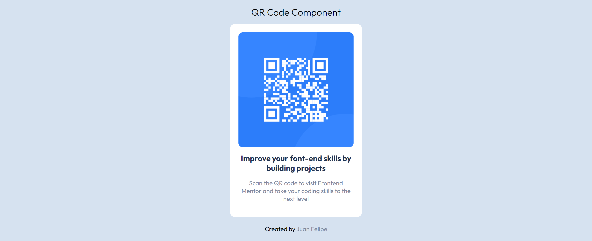

# Make It Real - QR Code Component

This is a solution to QR Code Component project of the Make It Real course.

## Table of contents

- [Overview](#overview)
  - [The challenge](#the-challenge)
  - [The result](#the-result)

## Overview

### The challenge

The challenge was about to clone the next image:

### The result
The next was the result of the code:

